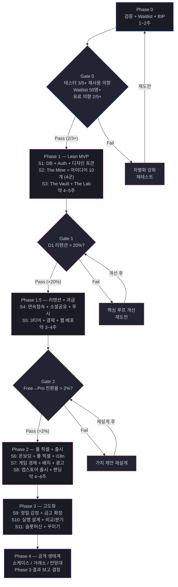

# Phases Roadmap

> Gate-Based Development. 검증 -> 판단 -> 진행. 일직선이 아니라 Gate마다 멈추고 확인한다.
> 현재 Sprint 상세: [[CURRENT-SPRINT]]

---

## 전체 구조



---

## Phase 0 — 검증 (1~2주, 코딩 아님)

**목표:** 코드 한 줄 쓰기 전에 "이 제품이 만들 가치가 있는가?" 확인.

### Week 1: 만들기 + 배포

| Day | 할 일 |
|-----|-------|
| 1~2 | ChatGPT 비교 테스트 — 6원석 조합을 ChatGPT에 직접 요청해보고 결과 비교 |
| 1~2 | Waitlist 랜딩 배포 (ideamineai.com) — 구조는 [[GTM-Strategy]] 참조 |
| 3~4 | 프로토타입 — 실제 Expo 앱에서 키워드 선택 -> OpenAI 호출 -> 결과 표시 (최소한만) |
| 5 | 트위터/X BIP 첫 게시 + 테스터 모집 시작 |

### Week 2: 테스트 + 분석

| Day | 할 일 |
|-----|-------|
| 6~10 | 주변 기획자/창업자 5~10명에게 프로토타입 공유 + 피드백 |
| 6~10 | Van Westendorp 4질문 실시 (가격 감각 파악) |
| 11~14 | 결과 분석 + Gate 판단 |

### Gate 0: 아래 3개 중 2개+ 통과?

1. 테스터 5명 중 3명+ "다시 쓰고 싶다"
2. Waitlist 등록 50명+
3. 테스터 5명 중 2명+ "유료라도 쓸 의향"

**Yes -> Phase 1. No -> 차별화 강화 후 재테스트.**

### GTM 병행

- BIP 시작 (매일 15분, 주 3~5회)
- 커뮤니티 시딩 시작 (디스콰이엇, 긱뉴스 등)
- 상세: [[GTM-Strategy]]

---

## Phase 1 — Lean MVP (Sprint 1~3, 약 4~5주)

**목표:** 핵심 루프만 돌아가는 최소 제품. 이것만으로 "유용하다"를 검증.

### Sprint 1 — DB + Auth + 디자인 토큰

- [ ] DB 스키마 생성 (Supabase)
- [ ] **Supabase RLS 활성화** (모든 테이블에 즉시 적용 — [[Security-Policy]] #2)
- [ ] **API 키 아키텍처 확정** (프론트→백엔드→OpenAI, 키 환경변수 관리 — [[Security-Policy]] #3)
- [ ] 키워드 시드 데이터 109개 삽입 (6카테고리, 한/영, 내부 subtype 메타데이터 포함)
- [ ] Supabase Auth 연동 (이메일/소셜)
- [ ] EAS Build 초기 세팅 (development build)
- [ ] **픽셀 폰트 로딩** (Press Start 2P + 한글 본문 폰트)
- [ ] **컬러 테마 토큰** (constants/theme.ts — [[Color-Theme]] 기반)
- [ ] **이미지 렌더링 설정** (pixelated, 안티앨리어싱 off)
- [ ] 공통 UI 컴포넌트 기초 (PixelButton, PixelCard, PixelText)

### Sprint 2 — The Mine + 아이디어 생성

- [ ] 오늘의 광맥 3개 생성 로직 (백엔드)
- [ ] 광맥 카드 UI (캐러셀)
- [ ] **광맥 카드 기본 프레임** (일반/반짝/희귀 3종 — 최소 픽셀)
- [ ] **키워드 칩** (카테고리별 컬러 매핑)
- [ ] 리롤 (무료 2회)
- [ ] **Haptic 피드백** (리롤, 채굴)
- [ ] OpenAI 프롬프트 설계 (한/영 분기) + **프롬프트 인젝션 방어 적용** ([[Security-Policy]] #1)
- [ ] 아이디어 **10개** 생성 API (4군: 안정3 + 확장3 + 전환2 + 희귀2)
- [ ] **Abuse Prevention L1** (유저 ID 기반 속도 제한: 분당 3회, 시간당 20회)
- [ ] **Abuse Prevention L2** (일일 상한: Free 1회, Lite 5회, Pro 50회)
- [ ] **Abuse Prevention L4** (비용 차단기: 유저 단위 + 시스템 전체)
- [ ] **AI 비용 로깅** (`ai_usage_logs` 테이블 — 13필드, 모든 AI 호출 기록)
- [ ] **L3 시그널 로깅** (행동 패턴 데이터 수집 — 자동 대응은 Phase 1.5~2)
- [ ] 원석 결과 화면
- [ ] 원석 선택 -> 금고 반입
- [ ] user_daily_state 관리

### Sprint 3 — The Vault + The Lab

- [ ] 금고 화면 (저장된 아이디어 목록)
- [ ] 아이디어 상세 보기
- [ ] 삭제/관리
- [ ] 프로젝트 개요 생성 API (OpenAI)
- [ ] 개요서 화면 (문제 정의, 타겟, 기능, BM)
- [ ] 기본 감정(Appraisal) 생성
- [ ] **감정 결과 스코어 UI** (최소 픽셀)
- [ ] 개요서 저장 -> 금고 연결
- [ ] 개요서 텍스트 복사/내보내기
- [ ] 캠프(Camp) 기본 (프로필, 설정, 로그아웃)

### Sprint 3.5 — MCP 서버 배포 (1~2일)

- [ ] MCP 서버 (Python/FastMCP) — 백엔드 API 위 얇은 래퍼
- [ ] 도구 4개: show_veins, reroll, mine, overview
- [ ] API source 태그 (`source: "mcp"`) — 비용 분리 추적
- [ ] IP 기반 Rate Limiting (채굴 1회/일, 개요서 1회/일, 리롤 2회/일)
- [ ] 세계관 톤: 괄호 병기 ("광맥(키워드 조합)")
- [ ] 앱 유도 메시지 (저장/감정/추가 채굴 → ideamineai.com)
- [ ] MCP 마켓플레이스 등록

> Sprint 3에서 백엔드 API가 완성되므로, MCP는 그 위에 래퍼만 씌우면 됨. 1~2일 작업.
> Gate 1 전에 배포하면 MCP 유저 데이터도 Gate 판단에 활용 가능.
> 상세 스펙: `plans/2026-03-22-mcp-server-spec.md`

### Phase 1에서 의도적으로 빼는 것

| 뺀 것 | 이유 |
|-------|------|
| 온보딩 플로우 | 첫 화면이 바로 채굴이면 됨. 설명보다 체험 |
| 배지/퀘스트/레벨 | 핵심 루프 검증 후 추가 |
| 게임 경제 (3통화) | 핵심 루프와 무관. Gate 1 후 |
| i18n (한/영 UI) | 한국어 UI만 먼저. AI 출력은 언어 감지로 |
| 사운드 이펙트 | 있으면 좋지만 MVP에 필수 아님 |
| 공간 배경 일러스트 | Gate 1 후 투자 |
| 캐릭터 아바타 | Gate 1 후 투자 |
| 애니메이션 (채굴, 반입) | 최소한만. 로딩 스피너면 충분 |
| 공사 중 배너 | 불필요 |
| 광고 연동 | 유저 없이 광고 의미 없음 |

### Gate 1: 첫 50명의 D1 리텐션 > 20%?

**측정 방법:** PostHog 또는 Mixpanel (Sprint 3에서 기본 이벤트 트래킹 삽입)

- 첫 채굴 완료율
- 금고 반입률
- 개요서 생성률
- D1 재방문률

**Yes -> Phase 1.5. No -> 핵심 루프 개선 (같은 Sprint 반복).**

Gate 실패 시 점검:
1. 아이디어 품질이 충분한가? (프롬프트 튜닝)
2. 5개가 너무 적은가? (10개로 복원 테스트)
3. UI가 직관적인가? (세계관 용어 vs 일반 용어)

### GTM 병행

- BIP 지속 + 커뮤니티 시딩
- 첫 50명: 1:1 아웃리치 + 커뮤니티 (상세: [[GTM-Strategy]])

---

## Phase 1.5 — 리텐션 + 웹 + 과금 검증 (Sprint 4~5, 약 3~4주)

**목표:** 핵심 루프가 검증된 후, 재방문 장치 + 수익 모델 검증.

### Sprint 4 — 리텐션 + 소셜

- [ ] 데일리 광맥 갱신 시스템 (매일 새 광맥)
- [ ] 연속 접속 카운터 + 보상
- [ ] **연속 접속 픽셀 UI**
- [ ] 핑크 결정 기본 획득 (1종만, 최소 시스템)
- [ ] **아이디어 카드 소셜 공유** (SNS 공유용 이미지 — 바이럴 루프)
- [ ] **푸시 알림** (Expo Notifications — 데일리 채굴 리마인더)
- [ ] **Analytics 이벤트 트래킹** (핵심 KPI 전체)

### Sprint 5 — 3티어 + 결제 + 웹 배포

- [ ] **L3 행동 패턴 자동 대응 활성화** (Phase 1 수집 데이터 기반 임계값 설정)
- [ ] Free Miner / Mine Owner Lite / Mine Owner Pro 3티어 구현
- [ ] **구독 상태 서버 사이드 검증** (RevenueCat webhook 서명 검증 + profiles.tier 동기화 — [[Security-Policy]] #4)
- [ ] AI 키워드: Free=잠금, Lite=랜덤 배정, Pro=자유 선택
- [ ] **AI 잠금 슬롯 픽셀 디자인** (자물쇠 + 글로우)
- [ ] 5원석 vs 6원석 결과 나란히 비교 (Loss Aversion 프레이밍)
- [ ] RevenueCat 세팅 (iOS/Android)
- [ ] Polar.sh 세팅 (웹)
- [ ] Pro 7일 무료 체험 (카드 등록 불필요)
- [ ] 구독 상태 -> profiles 동기화 (webhook)
- [ ] **Expo Router 웹 버전 배포** (ideamineai.com)
- [ ] 웹: 첫 채굴 1회 무료 (로그인 불필요) -> 앱 전환 유도
- [ ] **웹 반응형 레이아웃** (max-width 제한)

### Gate 2: Free -> Pro 전환율 > 2%?

**Yes -> Phase 2. No -> 가치 제안 재설계.**

Gate 실패 시 점검:
1. 5원석 vs 6원석 품질 차이가 체감 가능한가?
2. Pro 체험 후 이탈 이유는?
3. 가격이 높은가? (Van Westendorp 재검토)

### GTM 병행

- PH / 디스콰이엇 론칭 (1일 집중)
- 웹에서 SEO 트래픽 시작
- BIP 지속

---

## Phase 2 — 풀 픽셀 + 게임 경제 (Sprint 6~8, 약 4~6주)

**목표:** Gate를 통과한 제품에 본격 투자. 풀 픽셀 아트 + 게임 경제 + 앱스토어 출시.

### Sprint 6 — 풀 픽셀 + 온보딩 + i18n

> 에셋 제작 사양, 파이프라인, 화면별 목록: `plans/2026-03-23-pixel-asset-plan.md`

- [ ] **온보딩 플로우** (세계관 소개 -> 첫 채굴 — [[Onboarding]] 참조)
- [ ] **온보딩 픽셀 일러스트** (3~4컷)
- [ ] **스플래시 픽셀 로고 애니메이션**
- [ ] **탭바 픽셀 아이콘** (Mine, Lab, Vault, Camp)
- [ ] **광산/금고/실험실 픽셀 배경**
- [ ] **광부 기본 아바타** (1종)
- [ ] **채굴 로딩 애니메이션** (곡괭이 모션)
- [ ] **반입 성공 애니메이션**
- [ ] **사운드 이펙트** (채굴, 반입, 리롤)
- [ ] i18n 세팅 (expo-localization + i18next)
- [ ] 한/영 번역 적용

### Sprint 7 — 게임 경제 + 리텐션 강화

- [ ] 배지 시스템 (MVP 3종 — [[Badge-System]] 참조)
- [ ] **배지 픽셀 아이콘** (3종)
- [ ] 데일리 퀘스트 (3종 — [[Daily-Quest]] 참조)
- [ ] **퀘스트 카드 픽셀 UI**
- [ ] 광부 레벨 시스템 (레벨업 -> 반입 슬롯 확장)
- [ ] **레벨업 픽셀 이펙트**
- [ ] 핑크 결정 획득/사용 확장
- [ ] 커스텀 키워드 입력 (Lite: 5카테고리, Pro: 6카테고리 — [[Tier-Structure]] 참조)
- [ ] AI 보정 (임베딩 우선 + GPT-4o-mini 폴백)
- [ ] Clean Mine Protocol 기본 1~3단계 ([[Clean-Mine-Protocol]] 참조)
- [ ] 광고 연동 (AdMob 보상형)
- [ ] **광고 유도 픽셀 연출** ("곡괭이 수리 중...")
- [ ] 공사 중 연출 (쇼케이스/거래소/전망대)

### Sprint 8 — 앱스토어 출시

- [ ] **이용약관 / 개인정보처리방침** (한/영)
- [ ] Apple Developer ($99/년) + Google Play ($25)
- [ ] EAS Build production (iOS + Android)
- [ ] **앱 아이콘 픽셀 디자인** (1024x1024)
- [ ] **앱스토어 스크린샷** (한/영)
- [ ] 앱스토어 설명 / 키워드 (한/영 — ASO)
- [ ] TestFlight + Google Play 내부 테스트
- [ ] **랜딩 페이지 리뉴얼** (Waitlist -> 다운로드 CTA)
- [ ] **랜딩 픽셀 히어로 일러스트**
- [ ] 앱스토어 제출 + 심사
- [ ] Programmatic SEO 시작 (상위 100개 조합 페이지)

---

## Phase 3 — 실험실 고도화 + Pro 가치 (Sprint 9~11)

**목표:** Pro 유저의 체감 가치를 높이고 깊은 기획 도구로 발전.

### Sprint 9 — 정밀 감정 + 금고 확장

- [ ] 정밀 감정 (Lite: 얕은 버전 / Pro: 풀 버전 — [[Tier-Structure]] 참조)
- [ ] 심층 감정 리포트 (Pro)
- [ ] **감정 리포트 픽셀 차트 UI**
- [ ] 금고 폴더/태그
- [ ] 주말 특별 광맥
- [ ] **특별 광맥 픽셀 프레임**
- [ ] 취향 광맥 해금

### Sprint 10 — 실행 설계 + 비교/분기

- [ ] 실행 설계 (Lite: 맛보기 / Pro: 풀)
- [ ] MVP 청사진 (Pro)
- [ ] Phase 로드맵 자동 생성 (Pro)
- [ ] **청사진 픽셀 다이어그램 UI**
- [ ] 원석 비교/분기/재정제 (Pro)
- [ ] 대안 시나리오 (Pro)

### Sprint 11 — 슬롯머신 + 꾸미기 + Pink Diamond

- [ ] 슬롯머신 자유 조합 UI
- [ ] **슬롯머신 픽셀 애니메이션** (릴 회전)
- [ ] Pink Diamond 인앱 구매
- [ ] **Pink Diamond 픽셀 아이콘**
- [ ] 꾸미기 상점 + 작업실 꾸미기
- [ ] **상점 아이템 픽셀 에셋** (가구 기본 세트)
- [ ] **작업실 픽셀 배경 + 레이어 배치**
- [ ] 아이디어 DNA 리포트

---

## Phase 4 — 공개 생태계 (Sprint 12~, 미정)

**목표:** Phase 3 결과를 보고 범위 결정. 사실상 별도 제품.

- 쇼케이스 오픈 (공개 전시)
- 거래소 / 투자자 탐색
- Clean Mine Protocol 4단계 (공개 악용 제재)
- 신뢰 광산주 / 전시 승인 기획자 배지
- 전망대 (트렌드 대시보드)
- 고대 동전 + 고대 교환소
- 실험실/금고 꾸미기 확장
- 시즌 상점 / 이벤트 교환
- 광부 캐릭터 꾸미기 확장
- 뉴스레터 자동 발행 ("오늘의 아이디어")
- Programmatic SEO 1,000페이지+ 확장

---

## 픽셀 아트 투자 시점

| 시점 | 범위 | 이유 |
|------|------|------|
| Phase 1 (Gate 전) | 폰트 + 컬러 + 기본 카드 프레임 + 키워드 칩 | 최소한의 정체성만 |
| Phase 1.5 | 잠금 슬롯 + 연속 접속 UI + 공유 카드 | 과금/바이럴에 필요한 것만 |
| **Phase 2 (Gate 후)** | **풀 투자** — 배경, 캐릭터, 애니메이션, 사운드, 앱 아이콘 | Gate 통과 = 투자 가치 증명 |
| Phase 3 | 차트 UI, 슬롯머신, 꾸미기 에셋 | Pro 가치 강화 |

---

## GTM 타임라인 (개발과 병행)

| 시점 | GTM 활동 | 상세 |
|------|----------|------|
| Phase 0 | Waitlist 랜딩 + BIP 시작 | [[GTM-Strategy]] |
| Phase 1 | BIP 지속 + 커뮤니티 시딩 + 1:1 아웃리치 | 첫 50명 목표 |
| Phase 1 (S3.5) | **MCP 서버 배포** — 개발자 획득 채널 | [[MCP-Distribution-Channel]] |
| Phase 1.5 | PH/디스콰이엇 론칭 + 웹 배포 | 첫 트래픽 폭발 |
| Phase 2 | 앱스토어 출시 + Programmatic SEO | 지속 성장 엔진 |
| Phase 3+ | 뉴스레터 + 콘텐츠 플라이휠 | 자동 콘텐츠 생산 |

---

## Gate-Based Development 핵심

```
[Phase N] -> Gate 판단 -> 통과? -> [Phase N+1]
                            |
                            +-> 실패? -> 현재 개선 후 재도전
```

Gate를 통과하지 못하면 다음 Phase가 아니라 현재를 개선.
17 Sprint를 일직선으로 달리지 않는다.

---

## 이 로드맵의 근거 문서

- [[Business-Audit]] — 6가지 프레임워크 종합 평가
- [[Improvement-Roadmap]] — Gate-Based Development 원본 제안
- [[GTM-Strategy]] — 마케팅/GTM 실행 계획
- [[Counter-Strategies]] — Playable Tool 전략
- [[Competitive-Analysis]] — 경쟁사 분석

---

## Related

- [[Project-Vision]] — 제품 비전
- [[Target-Audience]] — 타겟 정의

## See Also

- [[Phase-1-MVP]] — Phase 1 상세 범위 (09-Implementation)
- [[Pixel-Art-Style-Guide]] — 에셋 제작 가이드 (08-Design)
- [[Color-Theme]] — 컬러 토큰 (08-Design)
