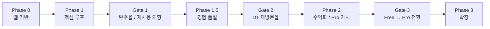

# Phase Flow

> v2의 Phase/Sprint 흐름과 진입/완료 기준을 관리하는 운영 지도.
> 실행 원칙은 [[Implementation-Plan]]을 따른다.

---

## 전체 흐름

---

## 현재 상태

> [!important]
> 현재 진행 중: **Phase 0 / Sprint 0**

현재 활성 대표 Task ID:

- `S0-DIR-01`
- `S0-DS-01`
- `S0-AUTH-01`
- `S0-API-01`
- `S0-SHELL-01`

상세 상태는 [[CURRENT-SPRINT]]에서 관리한다.

---

## Phase 0 — 웹 기반

**목표:** v2 웹 프론트엔드의 기초를 만든다. 로그인, 세션, 기본 App Shell뿐 아니라 Mine / Vault / Lab / Basecamp의 첫 공간 언어를 같이 고정한다.

**포함 Sprint:** Sprint 0

**핵심 범위:**

- 공간별 디자인 방향 고정
- 디자인 시스템 기초
- Supabase Auth 연결
- 백엔드 API 클라이언트 계층
- Mine / Vault / Lab / Basecamp App Shell

**대표 Task ID:**

- `S0-DIR-01` — Mine / Vault / Lab / Basecamp 공간감과 디자인 방향 고정
- `S0-DS-01` — 컬러 토큰, 기본 컴포넌트, 타이포그래피 계층
- `S0-AUTH-01` — Supabase JS 클라이언트, 로그인/세션, 보호 라우트
- `S0-API-01` — FastAPI 호출 계층, JWT 주입, React Query
- `S0-SHELL-01` — 메인 네비게이션, 레이아웃, 반응형 기본 구조

**진입 기준:**

- `apps/web/` 초기화 완료
- Tailwind v4 토큰 세팅 완료
- FastAPI / Supabase / v2 DB 체인 재사용 가능

**완료 기준:**

- Mine / Vault / Lab / Basecamp의 첫 비주얼 방향이 서로 구분된다
- 로그인과 세션 유지가 동작
- 보호 라우트와 프로필 확인이 가능
- Mine / Vault / Lab / Basecamp 이동이 동작
- 다음 Sprint에서 기능을 올릴 수 있는 App Shell이 준비됨

**실패 시 점검 포인트:**

- 공간별 분위기가 아직 하나로 뭉개져 있지 않은가
- Auth가 과하게 복잡해졌는가
- 라우팅보다 스타일 작업에 시간이 새고 있는가
- App Shell 범위가 불필요하게 커졌는가

---

## Phase 1 — 핵심 루프

**목표:** 웹에서 `Mine -> Vault -> Lab` 핵심 루프를 끝까지 완주하게 만든다.
기능과 공간 경험을 함께 올려서 "쓸 수 있다"와 "들어가고 싶다"를 동시에 만든다.

**포함 Sprint:** Sprint 1, Sprint 2

### Sprint 1 — Mine

**핵심 범위:**

- 오늘의 광맥 3개 조회
- 리롤
- 아이디어 10개 생성
- 결과 선택과 금고 반입 진입
- The Mine과 Result의 공간감, 선택 위계, 긴장감 구현

**대표 Task ID:**

- `S1-MINE-01` — today veins 조회와 상태 표시
- `S1-MINE-02` — reroll + mine action
- `S1-MINE-03` — mine action 로딩, 에러, 제한 상태 처리
- `S1-RESULT-01` — 아이디어 10개 결과 표시
- `S1-RESULT-02` — 아이디어 선택과 상태 관리
- `S1-RESULT-03` — 금고 반입 / 실험실 보내기 진입
- `S1-MINEUI-01` — The Mine 공간감과 시각 위계
- `S1-RESULTUI-01` — Result 화면 선택 경험과 긴장감

### Sprint 2 — Vault / Lab

**핵심 범위:**

- Vault 목록/상세
- Overview 생성
- Appraisal 생성
- Full Overview 생성
- Vault의 아카이브 감각과 Lab의 분석 공간감 구현

**대표 Task ID:**

- `S2-VAULT-01` — Vault 목록 조회
- `S2-VAULT-02` — Vault 상세와 재방문 흐름
- `S2-LAB-01` — Overview 생성
- `S2-LAB-02` — Appraisal 생성
- `S2-LAB-03` — Full Overview 생성
- `S2-LAB-04` — Lab 단계 간 이동과 상태 표시
- `S2-VAULTUI-01` — Vault 아카이브 구조와 정보 스캔성
- `S2-LABUI-01` — Lab 분석 공간의 위계와 집중감

**진입 기준:**

- Phase 0 완료
- Mine / Vault / Lab / Basecamp 기본 라우팅 안정화

**완료 기준:**

- 사용자가 Mine에서 시작해 Vault 저장 후 Lab에서 문서화까지 갈 수 있음
- `Full Overview`까지 Phase 1 범위 안에서 실제로 동작
- Mine / Vault / Lab 각각의 분위기와 상호작용 톤이 명확히 다르게 읽힘
- Gate 1 판단을 위한 최소 이벤트/피드백 수집 가능

**Gate 1:**

- 핵심 루프 완주율 60%+
- "다시 쓰고 싶다" 3/5+
- 개요/평가 결과 유용성 3/5+

**실패 시 점검 포인트:**

- Mine 결과 품질이 기대보다 약한가
- Vault가 단순 저장소처럼만 느껴지는가
- Lab 출력의 가치가 바로 전달되지 않는가
- 공간감이 기능 이해를 돕지 못하고 있는가
- 정보 구조나 카피가 복잡한가

---

## Phase 1.5 — 경험 품질

**목표:** 핵심 루프 위에 프리미엄 감각과 재방문 장치를 올린다.

**포함 Sprint:** Sprint 3, Sprint 4

**핵심 범위:**

- 프리미엄 모션
- 랜딩/가치 전달 강화
- 리텐션 장치
- 업그레이드 맥락 정리
- Phase 1에서 만든 공간 경험을 더 정교하게 강화

**대표 Task ID:**

- `S3-MOTION-01` — 프리미엄 모션 계층
- `S3-LANDING-01` — 랜딩/가치 서사 정리
- `S4-RET-01` — 재방문 유도 장치
- `S4-UPGRADE-01` — 업그레이드 표면과 CTA 맥락 정리

**진입 기준:**

- Gate 1 통과

**완료 기준:**

- 앱이 "쓸 수 있다"를 넘어 "다시 열어보고 싶다"는 감각을 줌
- 프리미엄 경험이 core utility를 가리지 않음

**Gate 2:**

- D1 재방문율 > 20%

**실패 시 점검 포인트:**

- 모션이 가치 전달보다 앞서고 있는가
- 리텐션 장치가 억지스럽거나 산만한가
- 업그레이드 유도가 너무 이른가

---

## Phase 2 — 수익화 / Pro 가치

**목표:** 가치가 검증된 뒤에 티어, 결제, Pro 전용 깊이를 붙인다.

**포함 Sprint:** Sprint 5, Sprint 6

**핵심 범위:**

- 티어 경계 정리
- Polar 기반 웹 결제
- Pro 전용 출력과 깊이 레이어
- 경제 레이어는 뒤에, utility는 앞에

**대표 Task ID:**

- `S5-TIER-01` — 티어 gating 정리
- `S5-BILL-01` — Polar 결제/업그레이드 연결
- `S6-PRO-01` — Pro 전용 문서 깊이와 가치 강화
- `S6-ECON-01` — 프리미엄 경제 레이어를 utility 뒤에 배치

**진입 기준:**

- Gate 2 통과

**완료 기준:**

- 유저가 Free / Lite / Pro 차이를 명확히 이해함
- 결제와 가치 전달이 UX 안에서 자연스럽게 이어짐
- 경제 레이어가 core loop를 가리지 않음

**Gate 3:**

- Free → Pro 전환율 > 2%

**실패 시 점검 포인트:**

- Pro 가치가 충분히 선명한가
- 결제 표면이 너무 이르거나 공격적인가
- 경제 요소가 utility보다 앞에 나오고 있지 않은가

---

## Phase 3 — 확장

**목표:** Gate 3 통과 후에만 확장 공간과 채널 확장을 연다.

**포함 범위 후보:**

- Showcase
- Exchange
- Observatory
- 팀 기능 / 공유 기능
- 웹 검증 후 모바일 판단

**대표 Task ID 후보:**

- `S7-SHOW-01` — Showcase 공개 흐름
- `S7-OBS-01` — Observatory 지표 공간
- `S8-EXCH-01` — Exchange 초기 매칭 흐름
- `S8-MOBILE-01` — 웹 검증 후 모바일 전환 판단

**진입 기준:**

- Gate 3 통과

**완료 기준:**

- 확장 범위를 실제 데이터와 반응을 바탕으로 결정
- 새 공간이 core loop를 약화시키지 않음

**실패 시 점검 포인트:**

- 확장 공간이 MVP보다 앞서가고 있지 않은가
- 아직 웹에서 검증되지 않은 가설을 너무 빨리 늘리고 있지 않은가

---

## 미래 확장 후보

- `Phase 3+` 공간: Showcase / Exchange / Observatory
- `Post-web validation`: mobile / RevenueCat / push notifications

---

## Related

- [[Implementation-Plan]] — 실행 계약과 운영 규칙
- [[Phase-1-MVP]] — v2 MVP 범위
- [[CURRENT-SPRINT]] — 현재 Sprint 현황

## See Also

- [[V2-Roadmap]] — Gate와 상위 순서
- [[Tech-Stack]] — 아키텍처 기반
